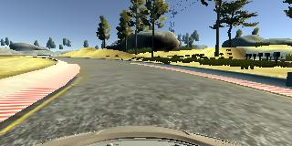
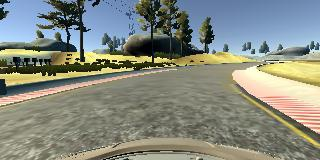
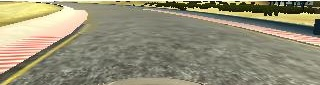

# Behavioral Cloning 

Author : Manoj Kumar Subramanian

------

## Overview

This repository is as part of my Submission to the Project 3: Behavioral Cloning Project for the Udacity Self Driving Car Nano Degree Program.

In this project, deep neural networks and convolutional neural networks are used to clone driving behavior. The model is trained, validated and tested using Keras. The model will output a steering angle to an autonomous vehicle with the Udacity provided simulator. 

First we need to steer a car around a tracks for data collection. Then we'll use image data and steering angles to train a neural network and then use this model to drive the car autonomously around the tracks.

-----

### Behavioral Cloning Project

The goals / steps of this project are the following:
* Use the simulator to collect data of good driving behavior
* Build, a convolution neural network in Keras that predicts steering angles from images
* Train and validate the model with a training and validation set
* Test that the model successfully drives around track one without leaving the road
* Summarize the results with a written report
--------------

## Rubric Points
**1. Submission includes all required files and can be used to run the simulator in autonomous mode**

**Review Set**

To meet specifications, the project required submitting five files: 

- [model.py](model.py) (script used to create and train the model)
- [drive.py](drive.py) (script to drive the car)
- a model file, [model_track_1.h5](model_track_1.h5) (a trained Keras model)
- a report [writeup](writeup_report.md) file (this file)
- a [video](model_track_1_run.mp4) file recording of the vehicle driving autonomously around the track for at least one full lap 

As an optional exercise the model is extended to run in track 2 jungle theme which is slightly complex compared to track 1, with few ramps and downs, shadows and with sharp turns.

The same model.py script is used to train the model, [model_track_both.h5](BothTracks/model_track_both.h5) and this [video2](BothTracks/model_track_both_run.mp4) provides the simulation corresponding to the trained model parameters on both the tracks.

---------

**2. Submission includes functional code**

Using the Udacity provided simulator and my drive.py file, the car can be driven autonomously around the track by executing 
```sh
python drive.py model_track_1.h5 [--speed 12]
```

The above command will load the trained model [model_track_1.h5](model_track_1.h5) and use the model to make predictions on individual images in real-time and send the predicted angle back to the server via a websocket connection. The optional argument speed is the target set speed for the simulator model to run. The drive.py model uses a PI control logic to adhere to the set speed.

For the model file model_track_1.h5, the track 1 runs with the set speed from 8 to 16 without going off road.

For the generated model file model_track_both.h5, both the tracks run with the set speed as 9 to 12 without going off road.

----

**3. Submission code is usable and readable**

The model.py file contains the code for training and saving the convolution neural network. The file shows the pipeline I used for training and validating the model, and it contains comments to explain how the code works.

----------

### Model Architecture and Training Strategy

**1. An appropriate model architecture has been employed**

My model, inspired by both the NVIDIA and LeNet5 model architecture, consists of layers that can be visualized as extended LeNet5 model but a reduced NVIDIA model. 

Below is a snapshot of my model:

```python
# Creating a sequential model
model = Sequential()
```
The data is normalized in the model using a Keras lambda layer.


```python
# Use lambda to normalize the values
model.add(Lambda(lambda x: (x / 255.0) - 0.5, input_shape=(160,320,3)))

# trim image to only see section with road
model.add(Cropping2D(cropping = ((60,15),(0,0))))

# adding convolution layers with rigorous maxpooling with elu activation function
model.add(Convolution2D(16,5,5,activation="elu"))
model.add(MaxPooling2D())
model.add(Convolution2D(32,5,5,activation="elu"))

# Dropout layer 1 to reduce overfitting
model.add(Dropout(.25))

model.add(MaxPooling2D())
model.add(Convolution2D(48,3,3,activation="elu"))
model.add(MaxPooling2D())
model.add(Convolution2D(64,3,3,activation="elu"))
model.add(MaxPooling2D())

# Flatten
model.add(Flatten())
model.add(Dense(120))

# Dropout layer 2 to reduce overfitting
model.add(Dropout(.25))
model.add(Dense(60))
model.add(Dense(1))

# Use meas square error loss function and adam optimizer
model.compile(loss = 'mse', optimizer = 'adam')
```
The model includes ELU layers to introduce nonlinearity as suggested by my reviewer in the previous project and I did get good results with that. 

-----------

**2. Attempts to reduce over-fitting in the model**

The model contains 2 dropout layers in order to reduce over-fitting. 

The model was trained and validated on different data sets to ensure that the model was not over-fitting. 

```
dict_keys(['loss', 'val_loss'])

[0.021351781623013835, 0.011106089238755987, 0.011046232438950551, 0.010437979799137905, 0.010400431804672474]

[0.011114087152796296, 0.011068746433731649, 0.011129142931447579, 0.0092389183477140386, 0.010090619466258305]
```

The converging values between the training loss and the validation loss suggests that the model is not overfitting the data.

The model was tested by running it through the simulator and ensuring that the vehicle could stay on the track.

-----------

**3. Model parameter tuning**

The model used an Adam optimizer with the default parameters, so the learning rate was not tuned manually.

-----------

**4. Appropriate training data**

Training data was chosen to keep the vehicle driving on the road. I used a combination of center lane driving, recovering from the left and right sides of the road. 

For details about how I created the training data, see the next section. 

------

## Model Architecture and Training Strategy

**1. Solution Design Approach**

Initially, I captured about 2 laps of the first track data on to a folder.

> I have followed the same sequence of code that was mentioned in the lecture videos. By making the dataset samples from the csv file, splitting the set into training and validation samples, using a generator to batch process the samples, as it is from the lecture videos, with the setting of steering corrections of 0.2 for the left and right images, I was able to move around the vehicle in the autonomous mode.
>

I used a convolution neural network model similar to the LeNet model but since the size of the image to compare is quite high 160x320 compared to the 32x32 image set discussed in LeNet. So I added one more convolutional layer deeper. 

I didn't perform any additional augmentation but used the flipping of all the three images (left, right, center) and increased the total data set by twice.

| Original Image                           | Flipped Image                            |
| ---------------------------------------- | ---------------------------------------- |
|  |  |

I have used a correction factor of 0.2 for the steering angle for the images from left and right cameras.

I did the normalization on the lambda input layer and did a cropping using the cropping layer to remove the unwanted sky and car hood from the inputs.



------

**2. Final Model Architecture**

The final model architecture consisted of 

- 4 convolution layers (2 5x5 and 2 3x3 filter sizes) in the network, 
- each having a rigorous Max pooling layer to cut down the input size with increase number of filters 
- followed by 3 dense layers. 
- I have chosen the number of filters to be 16, 32, 48 and 64 as a random but progressive and the first run itself proven that the model is pretty fine with the initial level of predictions. 
- So, I tuned the base architecture to suit the dataset with only additions of drop out layers. 
- The default, (lecture referenced) , Mean square error loss function and ADAM optimizer without any tweaking in the parameters were used.

Here is a visualization of the architecture based on the keras model.summary output.

| Layer                     | Type           | Output shape        | Param # |
| ------------------------- | -------------- | ------------------- | ------- |
| lambda_1                  | (Lambda)       | (None, 160, 320, 3) | 0       |
| cropping2d_1              | (Cropping2D)   | (None, 85, 320, 3)  | 0       |
| convolution2d_1           | (Conv2D)       | (None, 81, 316, 16) | 1216    |
| maxpooling2d_1            | (MaxPooling2D) | (None, 40, 158, 16) | 0       |
| convolution2d_2           | (Conv2D)       | (None, 36, 154, 32) | 12832   |
| dropout_1                 | (Dropout)      | (None, 36, 154, 32) | 0       |
| maxpooling2d_2            | (MaxPooling2D) | (None, 18, 77, 32)  | 0       |
| convolution2d_3           | (Conv2D)       | (None, 16, 75, 48)  | 13872   |
| maxpooling2d_3            | (MaxPooling2D) | (None, 8, 37, 48)   | 0       |
| convolution2d_4           | (Conv2D)       | (None, 6, 35, 64)   | 27712   |
| maxpooling2d_4            | (MaxPooling2D) | (None, 3, 17, 64)   | 0       |
| flatten_1                 | (Flatten)      | (None, 3264)        | 0       |
| dense_1                   | (Dense)        | (None, 120)         | 391800  |
| dropout_2                 | (Dropout)      | (None, 120)         | 0       |
| dense_2                   | (Dense)        | (None, 60)          | 7260    |
| dense_3                   | (Dense)        | (None, 1)           | 61      |
| Total params: 454,753     |                |                     |         |
| Trainable params: 454,753 |                |                     |         |
| Non-trainable params: 0   |                |                     |         |

------

**3. Creation of the Training Set & Training Process**

The following were done on a recursive manner to produce the result that is captured in this [video](model_track_1__run.mp4)

* Driven the first track mostly keeping the vehicle in center and gathered the images.

* Visualized the histogram of the csv file and noticed that the training set are more biased to 0 steering angles.

* So, driven the first track carefully around the corners to gather more data with the steering angles of larger values.

* Then added few more dataset by adding recovery images by taking the vehicle near to the edges of the track and recording the vehicle pulling to the center from road edges.

  --------------

  **Before training**


* Reduced two-third of data from the center driven data set by removing data having the steering angles less than 0.02 on both sides and kept only one-third of that.

  -----------------

  **On the training,**


* I have used the AWS gpu2.2xlarge instance to train the model.

* First trained the model with the carefully driven corner file so that the variations on both side larger angles(considering the flipped images) were well captured by the model. 

* An epoch of 5 and batch size as 32 is used in the generator.

* Loaded the model with weights from previous step and trained the model for recovery track data.

* Again loaded the model with weights from previous step and trained with the reduced data.

  --------

  **Simulation**


* My initial run with the fully trained model completed the lap, but didn't took a turn after the bridge, instead went offroad and joined the track later in the track.

* Noticed the tip from Readme later and edited the drive.py to send the BGR values instead of RGB

* With the above trained model, the simulation went well on 9kph completing the lap successfully on the track.

* Tried the model run with the speed 16kph and the model was successfully completing the laps.

* At a higher speed of about 25kph, the model had struggled to keep on track and went off the road.

  ------

  ## Optional Exercise - Track 2

I tried to put my luck on the track 2 jungle theme but with the model trained only from the track 1, it didn't climb the first turn itself. Then I followed the regular process again to make the model align for both tracks.

**Data collection**

* For the second track, I drove the care very carefully at a slow speed mostly keeping the car on the road center.

* Didn't modify any on the model codes

  -------

**Training**

* As my previous practice, loaded the trained model from track 1 and on top of that trained for the second track data (mostly centered data) 

* The final trained model [model_track_both.h5](BothTracks/model_track_both.h5) is used for running on both the tracks.

  --------------

**Simulation**

* The trained model is tried out on the track 2 which produced very good results on maintaining the car on the road and completing the lap.
* The same model when run of track 1 had some wiggling effect which is expected, but this also did complete the track without going off-road though not smooth.
* This [video2](BothTracks/model_track_both_run.mp4) shows the result of the model_track_both.h5 on both the tracks.